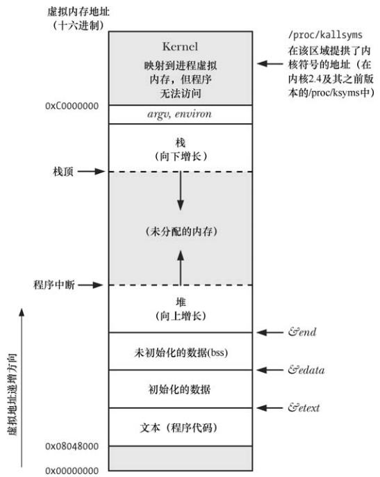
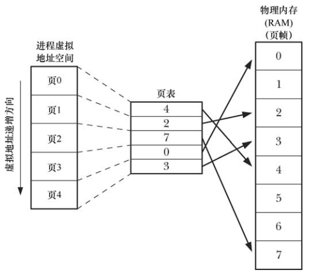
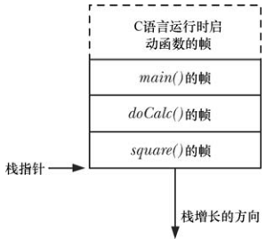
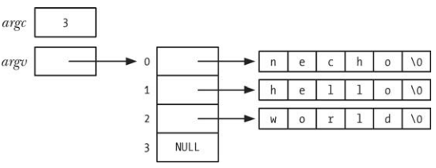

# 进程和程序

进程是一个可执行程序的实例，程序包含了一系列信息文件，这些信息描述了如何在运行期间创建一个进程：

- 二进制格式标识 ： 包含用于描述可执行文件格式的元信息，内核根据此信息来解释文件中的其他信息：
  - a.out(汇编程序输出)
  - COFF(通用文件格式)
  - ELF(可执行连接格式)，目前大多数 linux 实现采用此种方式，具有更多有点
- 机器语言指令 ：对程序算法进行编码
- 程序入口地址 ：标识程序开始执行时的起始指令位置
- 数据 ：程序文件包含的变量初始值和程序使用的字面量值(比如字符串)
- 符号表及重定位表 ：描述程序中函数和变量的位置及名称，包括调试和运行时的符号解析(动态链接)
- 共享库和动态链接信息 ：程序文件所包含的一些字段，列出程序运行时需要使用的共享库，以及加载共享库的动态链接器的路径名
- 其他信息 ：程序文件还包含了很多其他信息，用以描述如何创建进程

可以用一个程序来创建很多进程。

从内核角度来看：

- 进程是内核定义的抽象的实体，并为该实体分配用以执行程序的各项系统资源。
- 进程由用户内存空间和一系列内核数据结构组成，用户内存空间包含了程序代码及代码所使用的变量，内核数据结构则用于维护进程状态信息，其中包括：
  - 进程相关的标识号
  - 虚拟内存表
  - 打开文件的描述表
  - 信号传递和处理的相关信息
  - 进程资源使用及限制
  - 当前工作目录
  - 一些其他信息

# 进程号和父进程号

每个进程都有一个进程号 PID，是一个正数，唯一标识系统中的某个进程。

```
#include <sys/types.h>
#include <unistd.h>

pid_t getpid(void);
```

- `getpid` 返回值的数据类型是 `pid_t` ，专用于存储于进程号
- Linux 内核限制进程号需要小于 32767(内核常量 `PID_MAX` 定义)，新进程创建时，内核会按顺序将一个可用的进程号分配给其使用，进程号到达 32767 的限制时，内核将重置进程号计数器为300(不是1)

```
#include <sys/types.h>
#include <unistd.h>

pid_t getppid(void);
```

- `getppid` 获取父进程的进程号
- 产看 `/proc/PID/status` 文件提供的 `PPid`  字段可以获知每个进程的父进程
- `pstree` 命令可以查看进程家族树

# 进程内存布局

每个进程所分配的内存都由很多虚拟内存逻辑划分的部分，称之为 "段"：

- 文本段 ： 包含了进程运行的程序机器语言指令，文本段是只读的，也是可共享的
- 初始化数据段 ： 包含显式初始化的全局变量和静态变量
- 未初始化数据段 ： 包含了未显示初始化的全局变量和静态变量，程序启动之前，系统将本段内所有内存初始化为0，这个段又称为 BSS(block started by symbol) 段。未初始化的全局变量和静态变量与初始化的全局变量和静态变量分开放的原因：
  - 程序在磁盘存储时，没有必要为未经初始化的变量分配存储空间
  - 可执行文件只需要记录未初始化数据段的位置及大小，直到运行时再有程序加载器来分配这一空间
- 栈：动态增长和收缩的段，由栈帧组成，系统会为每个当前调用的函数分配一个栈帧，栈帧中存储了函数的局部变量，实参和返回值
- 堆 ：在运行时为变量动态进行分配的一块区域，堆顶端称为 program break

初始化数据段和未初始化数据段又常被称为用户初始化数据段和零初始化数据段。

`size` 命令可以显示二进制文件的文本段，初始化数据段，未初始化数据段的大小。



- `argv`  和  `environ`  用来存储程序的命令行实参和环境列表
- 十六进制的地址会因为内核配置和程序链接选项的差异而有所不同
- 灰色区域表示这些范围在进程虚拟地址空间中不可用，也就是说没有为这些区域创建页表

# 虚拟内存管理

linux 内核采用虚拟内存管理技术，该技术利用了大多数程序的一个典型特征，即访问局部性：要求高效使用 CPU 和 RAM(物理内存)资源：

- 空间局部性 ：程序倾向于访问在最近访问过的内存地址附近的内存(指令是顺序执行的)
- 时间局部性 ：程序倾向于在不久将来再次访问最近刚访问的内存地址(由于循环)

正是因为局部性特征，使得程序即便在仅有部分地址空间存在于  RAM 中，依然可以获得执行。

虚拟内存的规划之一就是将每个程序使用的内存切割成小型的，固定大小的 "页"  单元。相应的，将 RAM 划分成一系列与虚拟页尺寸相同的页帧：

- 任意时刻，每个程序仅有部分页驻留在物理内存页帧中，这些页构成了所谓的驻留集
- 程序未使用的页拷贝保存在交换区，交换区是磁盘空间中的保留区域，是作为计算机 RAM 补充，仅在需要时才会载入物理内存
- 若进程欲访问的页面并未驻留在物理内存中，将会发生页面错误(page fault)，内核即刻挂起进程的执行，同时从磁盘中将该页面载入内存

页面的大小通常为 4096 个字节，但也有的实现使用更大的页面。

内核中维护了一张页表，该页表描述了每页在进程虚拟地址空间中的位置：页表中的每个条目要么指出这个虚拟页面在 RAM 中的具体位置，要么表明其驻留在磁盘上。

进程虚拟地址空间中，并非所有的地址范围都需要页表条目：

- 由于可能存在大段的虚拟地址空间并未投入使用，因此也不需要为其维护页表条目
- 进程试图访问的地址无页表条目与之对应，那么进程将收到  `SIGSEGV` 信号

由于内核能够为进程分配和释放页和页表条目，所以进程的有效地址范围在其声明周期内可以发生变化：

- 栈向下增长超出了之前未达到的位置
- 堆中分配或者释放内存时引起 program break 位置的变化
- 调用 `shmat()` 连接 System V 共享内存区或者调用 `shmdt()` 脱离共享内存区时
- 调用 `mmap()`  创建内存映射时，或者调用 `munmap()` 解除内存映射时



虚拟内存的实现需要硬件中分页内存管理单元(PMMU)的支持，PMMU 把要访问的每个虚拟地址转换成相应的物理内存地址，当特定虚拟内存地址所对应的页没有驻留在 RAM 中时，将以页面错误通知内核。

虚拟内存管理使虚拟地址空间与 RAM 物理地址隔离，带来的优点：

- 进程与进程，进程与内核相互隔离，一个进程不能读写另一个进程或内核中的数据，因为每个进程的页表条目指向 RAM 或交换分区中不同的物理页面集合
- 适当情况下，两个或者更多的进程能够共享内存，因为内核可以使不同进程的页表条目指向相同的 RAM 页，经常发生在下面的情形：
  - 多个程序执行相同的程序文件或者加载相同的共享库时，会共享一份代码副本
  - 可以使用  `shmget()`  和 `mmap()`  等系统调用显式的请求与其它进程共享内存区，这么做是出于通信的目的
- 便于实现内存保护机制，可以对页表条目进行标记，以表示相关页面内容是可读、可写、可执行，多个进程共享 RAM 页面时，允许每个进程对内存采取不同的保护措施，例如一个进程可能以只读方式访问某页面，而另一进程则以读写方式访问同一页面
- 程序员和编译器、链接器之类的工具无需关注在 RAM 中的物理布局
- 因为需要驻留在内存中的仅是程序的一部分，所以程序在加载和运行时都很快，而且，一个进程所占用的虚拟内存大小能够超出 RAM 容量
- 每个进程使用的 RAM 减少了，RAM 中同时可以容纳的进程数量就增多了，从而任意时刻，CPU 都可执行至少一个进程，CPU 的利用率也会提高

# 栈和栈帧



栈驻留在内存的高端，并向下增长，专用寄存器——栈指针(stack pointer)，用于跟踪当前栈顶。

每次函数调用时，会在栈上新分配一帧，每当函数返回，再从栈上将此帧移去。

通常将这里的栈称为用户栈，以便与内核栈加以区分，内核栈是每个进程驻留在内核内存中的内存区域，在执行系统调用的过程中供内核内部函数调用使用。

每个用户栈包括的信息：

- 函数实参和局部变量
- 函数调用链接信息


# 命令行参数




