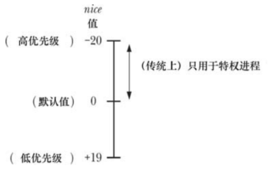

# 进程优先级(nice 值)

Linux 调度进程使用 CPU 的默认模型是循环时间共享，每个进程轮流使用 CPU 一段时间，这段时间被称为时间片或量子，这种模型满足：

- 公平性：每个进程都有机会使用到 CPU
- 响应性：一个进程在使用 CPU 之前无需等待太长时间

循环时间共享法特点：

- 进程无法直接控制何时使用 CPU 以及使用 CPU 的时间
- 每个进程轮流使用 CPU 直至时间片被用光或自己自动放弃 CPU (如进行睡眠或者执行一个磁盘读取操作)
- 如果所有进程都试图尽可能多地使用 CPU，即没有进程睡眠或被 IO 阻塞，那么它们使用 CPU 的时间差不多是相等的

进程特性 nice 值允许进程间接地影响内核调度算法，每个进程都有一个  nice 值，其范围 -20 ~ 19，默认值为 0。



使用 `fork()`  创建子进程时会继承 nice 值并且该值会在 `exec()` 调用中得以保持。

## nice 值得影响

进程的调度不是严格按照 nice 值得层次进行的，nice 值是一个权重因素，它导致内核调度器倾向于调度拥有高优先级的进程。

给一个进程赋一个低优先级 nice 值并不会导致它完全无法用到 CPU，但会导致它使用 CPU 的时间变少。

nice 值对进程调度的影响程度则依据 Linux 内核版本的不同而不同。

## 获取和修改优先级

```
#include <sys/time.h>
#include <sys/resource.h>

int getpriority(int which, id_t who);
int setpriority(int which, id_t who, int prio);
```

- `which` 确定 `who` 参数如何被解释，其取值为：
  - `PRIO_PROCESS`：操作进程 ID 为 `who` 进程，如果 `who` 为 0，那么使用调用者的进程 ID
  - `PRIO_PGRP`：操作进程组 ID 为 `who` 的进程组中的所有成员，如果 `who` 为 0，那么使用调用者的进程组
  - `PRIO_USER`：操作所有真实用户 ID 为 `who` 的进程，如果 `who`  为 0，那么使用调用者的真实用户 ID
- `getpriority()` 返回由 `which` 和 `who` 指定的进程 nice 值，如果有多个进程符合指定的标准(当 `which` 为 `PRIO_PGRP` 或 `PRIO_USER` 时)，那么将返回优先级最高的进程 nice 值(即最小的数值)，`getpriority()` 成功时可能返回 -1，因此在调用这个函数之前要将 `errno` 设置为0，接着在调用之后检查返回值为-1以及 `errno` 不为0才能确认调用成功
- `setpriority()` 试图将 nice 值设置为一个超出范围(-20 ~ 19) 的 nice 值时，将直接设置为边界值

特权进程 `CAP_SYS_NICE` 能够修改任意进程的优先级，非特权进程可以修改自己的优先级和其他进程的优先级，前提是自己的有效用户 ID 与目标进程的真实或有效用户 ID 匹配。

非特权进程能够将自己的 nice 值最高提高到公式 `20-rlim_cur` 指定的值，`rlim_cur` 是当前的 `RLIMIT_NICE` 的软资源限制。

# 实时进程调度概述


