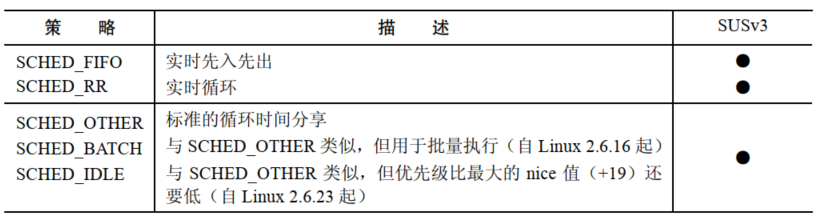

# 进程优先级(nice 值)

Linux 调度进程使用 CPU 的默认模型是循环时间共享，每个进程轮流使用 CPU 一段时间，这段时间被称为时间片或量子，这种模型满足：

- 公平性：每个进程都有机会使用到 CPU
- 响应性：一个进程在使用 CPU 之前无需等待太长时间

循环时间共享法特点：

- 进程无法直接控制何时使用 CPU 以及使用 CPU 的时间
- 每个进程轮流使用 CPU 直至时间片被用光或自己自动放弃 CPU (如进行睡眠或者执行一个磁盘读取操作)
- 如果所有进程都试图尽可能多地使用 CPU，即没有进程睡眠或被 IO 阻塞，那么它们使用 CPU 的时间差不多是相等的

进程特性 nice 值允许进程间接地影响内核调度算法，每个进程都有一个  nice 值，其范围 -20 ~ 19，默认值为 0。


使用 `fork()`  创建子进程时会继承 nice 值并且该值会在 `exec()` 调用中得以保持。

## nice 值得影响

进程的调度不是严格按照 nice 值得层次进行的，nice 值是一个权重因素，它导致内核调度器倾向于调度拥有高优先级的进程。

给一个进程赋一个低优先级 nice 值并不会导致它完全无法用到 CPU，但会导致它使用 CPU 的时间变少。

nice 值对进程调度的影响程度则依据 Linux 内核版本的不同而不同。

## 获取和修改优先级

```
#include <sys/time.h>
#include <sys/resource.h>

int getpriority(int which, id_t who);
int setpriority(int which, id_t who, int prio);
```

- `which` 确定 `who` 参数如何被解释，其取值为：
  - `PRIO_PROCESS`：操作进程 ID 为 `who` 进程，如果 `who` 为 0，那么使用调用者的进程 ID
  - `PRIO_PGRP`：操作进程组 ID 为 `who` 的进程组中的所有成员，如果 `who` 为 0，那么使用调用者的进程组
  - `PRIO_USER`：操作所有真实用户 ID 为 `who` 的进程，如果 `who`  为 0，那么使用调用者的真实用户 ID
- `getpriority()` 返回由 `which` 和 `who` 指定的进程 nice 值，如果有多个进程符合指定的标准(当 `which` 为 `PRIO_PGRP` 或 `PRIO_USER` 时)，那么将返回优先级最高的进程 nice 值(即最小的数值)，`getpriority()` 成功时可能返回 -1，因此在调用这个函数之前要将 `errno` 设置为0，接着在调用之后检查返回值为-1以及 `errno` 不为0才能确认调用成功
- `setpriority()` 试图将 nice 值设置为一个超出范围(-20 ~ 19) 的 nice 值时，将直接设置为边界值

特权进程 `CAP_SYS_NICE` 能够修改任意进程的优先级，非特权进程可以修改自己的优先级和其他进程的优先级，前提是自己的有效用户 ID 与目标进程的真实或有效用户 ID 匹配。

非特权进程能够将自己的 nice 值最高提高到公式 `20-rlim_cur` 指定的值，`rlim_cur` 是当前的 `RLIMIT_NICE` 的软资源限制。

# 实时进程调度概述

实时调度策略 `SCHED_RR` 和  `SCHED_FIFO` 优先级要高于标准循环时间分享策略(`SCHED_OTHER`)来调度的进程。

Linux 提供 99 个实时优先级，其数值从 1 ~ 99，并且这个取值范围同时适用于两个实时调度策略。每个策略中的优先级是等价的，这意味着如果两个进程拥有同样的优先级，一个进程采用了 `SCHED_RR` 策略，一个采用了 `SCHED_FIFO` 策略，那么两个都符合运行的条件，至于到底运行哪个则取决于它们被调度的顺序。

每个优先级级别都维护着一个可运行的进程队列，下一个运行的进程是从优先级最高的非空队列的队头选取出来的。

## SCHED_RR  策略

`SCHED_RR`  策略，优先级相同的进程以循环时间分享得方式执行，进程每次使用 CPU 的时间为一个固定长度的时间片，一旦被调度执行之后，使用 `SCHED_RR` 策略的进程会保持对 CPU 的控制直到下列条件中的一个得到满足：

-  到达时间片的终点了
- 自愿放弃 CPU，这可能是因为执行了一个阻塞式系统调用或调用了 `sched_yield()` 系统调用
- 进程终止了
- 被一个优先级更高的进程抢占了

对于上面四种情况，前两个情况导致进程丢掉 CPU 之后将会被放置在与其优先级级别对应的队列的队尾，在最后一种情况下，当优先级更高的进程执行结束之后，被抢占的进程会继续执行直到其时间片的剩余部分被消耗完(即被抢占的进程仍然位于与其优先级级别对应的队列的队头)。

在 `SCHED_RR` 和 `SCHED_FIFO` 两种策略中，当前运行的进程可能会因为下面某个原因被抢占：

- 之前被阻塞的高优先级进程解除阻塞了(如它所等待的 IO 操作完成了)
- 另一个进程的优先级被提到了一个级别高于当前运行的进程的优先级的优先级
- 当前运行的进程的优先级被降低到低于其他可运行的进程的优先级

`SCHED_RR` 和 `SCHED_OTHER` 类似，即它允许优先级相同的一组进程分享 CPU 时间，它们之间最重要的差别在于 `SCHED_RR` 策略存在严格的优先级级别，高优先级的进程总是优先于低优先级较低的进程。而在 `SCHED_OTHER` 策略中，低 nice 值得进程不会独占 CPU，它仅仅在调度决策时为进程提供了一个较大的权重。另一个重要的区别是 `SCHED_RR` 策略允许精确控制进程被调用的顺序。

## SCHED_FIFO 策略

`SCHED_FIFO ` 先入先出的策略与 `SCHED_RR` 相类似，它们之间最主要的差别在于 `SCHED_FIFO ` 策略中不存在时间片，一旦一个 `SCHED_FIFO ` 进程获得了 CPU 的控制权之后，它就会一直执行直到下面某个条件满足：

- 自动放弃 CPU
- 终止了
- 被一个优先级更高的进程抢占了

上面第一种情况中，进程会被放置在与其优先级级别对应的队列的队尾，在最后一种情况中，当高优先级进程执行了结束之后，被抢占的进程会继续执行，即被抢占的进程位于与其优先级级别对应的队列的队头。

## SCHED_BATCH 和 SCHED_IDLE 策略

Linux 2.6 内核增加了两个非标准调度策略：`SCHED_BATCH` 和 `SCHED_IDLE`。

- `SCHED_BATCH` 策略与默认的 `SCHED_OTHER` 策略类似，但是 `SCHED_BATCH` 策略会导致频繁被唤醒的任务被调度的次数较少，这种策略用于进程的批量式执行
- `SCHED_IDLE` 策略与默认的 `SCHED_OTHER` 策略类似，但是 `SCHED_IDLE` 提供的功能等价于一个非常低的 nice 值(即低于+19)，在这个策略中，进程的 nice 值毫无意义，它用于运行低优先级的任务，这些任务在系统中没有其他任务需要使用 CPU 时才会大量使用 CPU

# 实时进程调用 API

## 实时优先级范围

```
#include <sched.h>

int sched_get_priority_max(int policy);
int sched_get_priority_min(int policy);
```

- `sched_get_priority_min()` 和 `sched_get_priority_max()` 获取一个调度策略的优先级的取值范围
- `policy` 的取值一般是 `SCHED_RR` 或者 `SCHED_FIFO`

## 修改和获取策略和优先级

### 修改调度策略和优先级

```
#include <sched.h>

int sched_setscheduler(pid_t pid, int policy,const struct sched_param *param);
```

- `sched_setscheduler()` 修改 `pid` 进程的调度策略和优先级，如果 `pid` 是 0，那么将会修改调用进程的特性
- `param` 参数：

```
struct sched_param{
	int sched_priority;
};
```

-  `policy` 指定了进程的调度策略，可以是：



- 成功调用 `sched_setscheduler()` 会将 `pid` 指定的进程移到与其优先级级别对应的队列的队尾
- 通过 `fork()` 创建的子进程会继承父进程的调度策略和优先级，并且在 `exec()` 调用中会保持这些信息

```
#include <sched.h>

int sched_setparam(pid_t pid, const struct sched_param *param);
```

- `sched_setparam()` 可以修改一个进程的调度策略，但不会修改其优先级
- 成功调用 `sched_setparam()` 会将 `pid` 指定的进程移到与其优先级级别对应的队列的队尾

### 权限和资源限制会影响对调度参数的变更

特权进程(CAP_SYS_NICE) 能够随意修改任意进程的调度策略和优先级。

非特权进程也能够根据下列规则修改调度策略和优先级：

- 如果进程拥有非零的 `RLIMIT_RTPRIO` 软限制，那么它就能随意修改自己的调度策略和优先级，只要符合实时优先级的上限为其当前实时优先级的最大值及其 `RLIMIT_RTPRIO` 软限制值的约束即可
- 如果进程的 `RLIMIT_RTPRIO` 软限制值为 0，那么进程只能降低自己的实时调度优先级或从实时策略切换到非实时策略
- `SCHED_IDLE` 策略是一种特殊的策略，运行在这个策略下的进程无法修改自己的策略，不管 `RLIMIT_RTPRIO` 资源限制的值是什么
- 在其他非特权进程中也能执行策略和优先级的修改工作，只要该进程的有效用户 ID 与目标进程的真实或有效用户 ID 匹配即可
- 进程的软 `RLIMIT_RTPRIO` 限制值只能确定可以对自己调度策略和优先级做出哪些变更，这些变更可以由进程自己发起，也可以由其他非特权进程发起，拥有非零限制值的非特权进程无法修改其他进程的调度策略和优先级

### 获取调度策略和优先级

```
#include <sched.h>

int sched_getscheduler(pid_t pid);
int sched_getparam(pid_t pid, struct sched_param *param);
```

### 防止实时进程锁住系统

由于 `SCHED_RR` 和 `SCHED_FIFO` 进程会抢占所有优先级的进程，因此在开发使用这些策略时需要注意可能会发生失控的实时进程因一直占用 CPU 而导致锁住系统的情况，在程序中可以通过一些方法来避免这种情况：

- 使用 `setrlimit()` 设置一个合理的低软 CPU 时间组员限制，如果进程消耗了太多的 CPU 时间，那么它将收到一个 `SIGXCPU` 信号，该信号在默认情况下会杀死进程
- 使用 `alarm()` 设置一个警报定时器，如果进程的运行时间超出了 `alarm()` 调用指定的秒数，那么该进程会被 `SIGALARM` 信号杀死
- 创建一个拥有高实时优先级的看门狗进程，这个进程可以进行无限循环，每次循环都睡眠指定的时间间隔，然后醒来并监控其他进程的状态，并使用 `sched_getscheduler()` 和 `sched_param()` 来检查进程的调度策略和优先级，如果一个进程看起来行为异常，那么看门狗线程可以降低进程的优先级或向其发送合适的信号来停止或者终止进程
- `RLIMIT_RTTIME` 的单位是秒，它限制了一个进程在不执行阻塞式系统调用时能够消耗的 CPU 时间，当进程执行了这样的系统调用时，累积消耗的 CPU 时间将会被重置为 0，当这个进程被一个优先级更高的进程抢占时，累积消耗的 CPU 时间不会被重置，当进程的时间片被消耗完或调用 `sched_yield()` 时进程会放弃 CPU，当进程到达了 CPU 时间限制 `RLIMIT_CPU` 之后，系统会向其发送一个 `SIGXCPU` 信号，该U信号在默认情况下会杀死这个进程

### 避免子进程进程特权调度策略

`SCHED_RESET_ON_FORK`  可以指定为 `sched_setscheduler()` 中的 `policy` 参数，如果设置了这个标记，那么由这个进程使用 `fork()` 创建的子进程就不会继承特权调度策略和优先级，其规则为：

- 如果调用进程拥有一个实时调度策略，那么子进程的策略会被重置为标准的循环时间分享策略 `SCHED_OTHER`
- 如果进程的 nice 值为负值，那么子进程的 nice 值会被重置为 0

一旦进程启用了 `SCHED_RESET_ON_FORK` 标记，那么只有特权进程才能够仅有该标记，当子进程被创建出来以后，它的 `reset-on-fork` 标记会被禁用。

## 释放 CPU

实时进程可以通过两种方式自愿释放 CPU：通过调用一个阻塞进程的系统调用或者调用 `sched_yield()`。

```
#include <sched.h>

int sched_yield(void);
```

- `sched_yield()` 的操作比较简单，如果存在与调用进程的优先级相同的其他排队的可运行进程，那么调用进程会被放在队列的队尾，队列中队头的进程将会被调度使用 CPU，如果在该优先级队列中不存在可运行的进程，那么调用 `sched_yield()` 不会做任何事情，调用进程会继续使用 CPU
- 非实时进程使用 `sched_yield()` 的结果是未定义的

# SCHED_RR 时间片

```
#include <sched.h>

int sched_rr_get_interval(pid_t pid, struct timespec *tp);
```

- `sched_rr_get_interval()` 能够找出 `SCHED_RR` 进程每次被授权使用 CPU 时分配到的时间片的长度

# CPU 亲和力

当一个进程在一个多处理系统上被重新调度时无需在上一次执行的  CPU 上运行，之所以如此是因为原来的 CPU 有可能处于忙碌状态。

进程切换 CPU 时对性能会有一定的影响：如果在原来的 CPU 的高速缓冲器中存在进程的数据，那么为了将进程的一行数据加载进新 CPU 的高速缓冲器中，首先必须使这行数据失效(即在没被修改的情况下丢弃数据，在被修改的情况下将数据写入内存)，因为在多处理器架构中，为防止高速缓冲器不一致的情况，某个时刻只允许数据存在一个 CPU 的高速缓冲器上。这个失效的过程将会消耗时间，由于存在这个性能上的影响，进程保证软 CPU 亲和力在条件允许的情况下进程重新被调度到原来的  CPU 上运行。

设置 CPU 亲和力，将进程限制在一个或一组 CPU 上的原因：

- 可以避免由使高速缓冲器中的数据失效所带来的性能影响
- 如果多个线程或者进程访问同样的数据，那么当将它们限制在同样的 CPU 上的话可能会带来性能提升，因为它们无需竞争数据并且也不存在由此而产生的高速缓冲器未命中
- 对于时间关键的应用程序来说，可能需要为此应用预留一个或更多 CPU，而将系统中大多数进程限制在其他 CPU 上

```
#define _GNU_SOURCE    
#include <sched.h>

int sched_setaffinity(pid_t pid, size_t cpusetsize,const cpu_set_t *mask);
```

- `sched_setaffinity()` 设置 `pid` 进程的  CPU 亲和力，如果 `pid` 是 0，那么调用进程的 CPU 亲和力就会被改变
- CPU 亲和力是一个线程级特性，可以调整线程组中各个进程的 CPU 亲和力，如果需要修改一个多线程中某个特定线程的 CPU 亲和力的话，可以将 `pid` 设定为线程中的 `gettid()` 调用返回值，将 `pid` 设置为 0, 则表示调用线程
-  `cpusetsize` 是指定 `mask` 参数的字节数即 `sizeof(cpu_set_t)`
- `cpu_set_t` 是一个位掩码，但应该将其视为一个不透明的结构，所有对这个结构的操作都应该使用：

```
#define _GNU_SOURCE         
#include <sched.h>

void CPU_ZERO(cpu_set_t *set);
void CPU_SET(int cpu, cpu_set_t *set);
void CPU_CLR(int cpu, cpu_set_t *set);
int  CPU_ISSET(int cpu, cpu_set_t *set);
```

- `CPU_ZERO()` 将 `set` 初始化为空

- `CPU_SET()` 将 CPU cpu 添加到 `set` 中

- `CPU_CLR()` 从 `set` 中删除 CPU cpu 

- `CPU_ISSET()` 在 CPU cpu 是 `set` 的一个成员时返回 `true`

- CPU 集合中的 CPU 从 0 开始编号，`<sched.h>` 中定义了常量 `CPU_SETSIZE` 是比 `cpu_set_t` 变量能够表示的最大 CPU 编号还要大的一个数字

  

下面的代码将 `pid` 标识出的进程限制在 4 个 处理器上除第一个 CPU 之外的任意 CPU 上运行：

```
cpu_set_t set;

CPU_ZERO(&set);
CPU_SET(1,&set);
CPU_SET(2,&set);
CPU_SET(3,&set);

sched_setaffinity(pid,CPU_SETSIZE,&set);
```

如果 `set` 中指定的 CPU 与系统中的所有 CPU 都不匹配，那么 `sched_setaffinity()` 调用将会返回 `EINVAL` 错误。

如果运行调用进程的 CPU 不包括在 `set` 中，那么进程会被迁移到 `set` 中的一个 CPU 上。

非特权进程只有在其有效用户 ID 与目标进程的真实或有效用户 ID 匹配时才能够设置目标进程的 CPU 亲和力，特权进程(`CAP_SYS_NICE`) 进程可以设置任意进程的 CPU 亲和力。

```
#define _GNU_SOURCE 
#include <sched.h>

int sched_getaffinity(pid_t pid, size_t cpusetsize,cpu_set_t *mask);
```

- `sched_getaffinity()` 返回的 CPU 亲和力掩码位于 `mask` 指向的 `cpu_set_t` 的结构中，同时将 `cpusetsize` 参数设置为结构中包含的字节数，即 `sizeof(cpu_set_t)`，使用 `CPU_ISSET()` 宏能够确定哪些  CPU 位于 `set` 中
- 如果目标进程的 CPU 亲和力掩码并没有被修改过，那么 `sched_getaffinity()` 返回包含系统中所有  CPU 的集合
- `sched_getaffinity()` 不会检查权限，非特权进程能够获取系统上所有进程的 CPU 亲和力掩码

通过 `fork()` 创建的子进程会继承其父进程的 CPU 亲和力掩码，并且在 `exec()` 调用之间掩码会得以保留。


 


