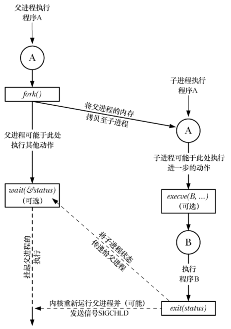
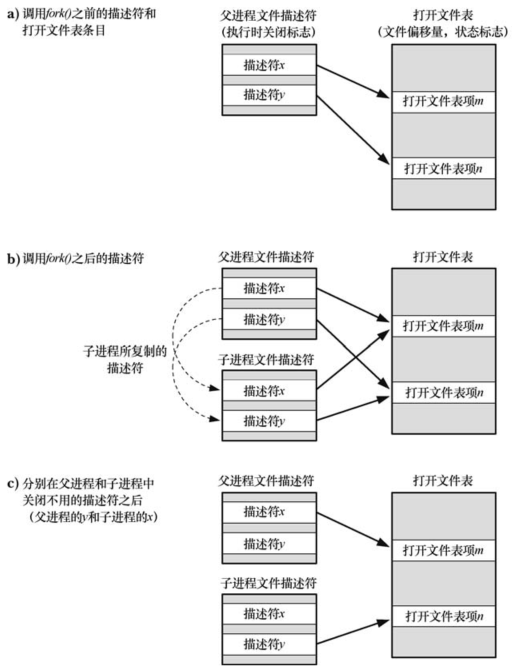
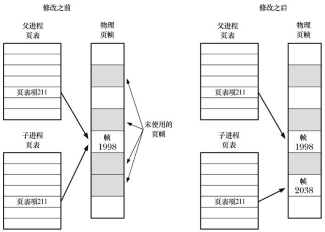

# `fork()`，`exit()`， `wawit`，`exevc()` 简介

- 系统调用 `fork()`允许某一进程创建新的进程：子进程获得父进程的栈，数据段、堆和执行文本段的拷贝，可以视为将父进程一分为二，这也是称为 `fork()` 的原因
- 库函数 `exit(status)` 终止进程，将进程占用的所有资源归还内核，交其进行再次匹配，`status` 表示进程的退出状态，父进程可以使用系统调用 `wait()` 来获取状态
- 系统调用 `wait(&status)` 的目的：如果子进程尚未调用 `exit()` 终止，那么 `wait()` 挂起父进程直至子进程终止；子进程的终止状态通过 `wait()` 的 `status` 参数返回
- 系统调用 `execve(pathname,argv,envp)` 加载一个新程序到当前进程的内存，这将丢弃现在的程序文本段，并为新程序创建栈，数据段以及堆，通常将这一动作称为执行一个新程序



- `execve()` 的调用不是必须的，子进程可以继续执行父进程相同的程序
- `wait()` 调用也是可选项，父进程可以对子进程不闻不问 

# 创建新进程：`fork()`

```
#include <sys/types.h>
#include <unistd.h>

pid_t fork(void);
```

- `fork()` 完成调用后将产生两个进程，并且每个进程都会从 `fork()` 的返回处继续执行
- 子进程和父进程拥有相同的程序文本段，子进程的栈，数据段，以及堆开始时是对父进程的相应部分的完全复制，但是执行 `fork()` 之后，每个进程都可修改各自的栈、数据段以及堆，而不影响另一个进程
- 调用 `fork()`成功之后，返回两次：父进程返回子进程的 ID，子进程返回0，当无法创建子进程时，`fork()` 返回 -1，失败的原因可能在于进程数超过了相应的限制

```
pid_t pid;
switch(pid = fork())
{
    case -1:
    //@ handle error
    case 0:
    //@ perform actions specific to child
    default:
    //@ perform actions specific to parent
}
```

- 调用 `fork()` 之后，子进程和父进程哪个先被调度是不确定的，这种不确定性可能导致 "竞争条件"

## 父、子进程间的文件共享

子进程会共享父进程打开的文件句柄，在任何一个进程中修改打开文件的属性，都会同步到另一个进程。父子进程间共享文件属性可以保证假设两个进程同时写入文件，共享文件偏移量会确保两者不会彼此覆盖。

如果不需要对这种文件描述符的共享方式，`fork()` 后的处理：

- 父、子进程使用不同的文件描述符
- 各自立即关闭不再使用的描述符



## `fork()` 的内存语义

内核将每一进程的代码段都笔记为只读，从而进程无法修改自身代码，这样，父子进程可以共享同一代码段，`fork()` 在为子进程创建代码段时，其所创建的一系列进程级页表项均指向父进程相同的物理内存页帧。

对于父进程的数据段、堆段和栈段中的各页，内核采用写时复制技术来处理：最初内核做了一些设置，令这些段的页表项指向与父进程相同的物理内存页，并将这些页面自身笔记为已读，调用 `fork()` 之后，内核会捕获所有父进程或子进程对这些页面的修改企图，并为将要修改的页面创建拷贝，系统将新的特迷昂拷贝分配给遭内核捕获的进程，还会对子进程的相应页表做适当调整，自此，父、子进程可以分别修改各自的页拷贝，互不影响：



# 系统调用 `vfork()`

```
#include <sys/types.h>
#include <unistd.h>

pid_t vfork(void);
```

- `vfork()` 可以为调用进程创建一个新的子进程，然而，`vfork()` 是为子进程立即执行 `exec()` 的程序专门设计的
- `vfork()` 与 `fork()` 的区别：
  - 无需为子进程复制虚拟内存页或页表，子进程共享父进程的内存，直至成功执行了 `exec()` 或者调用 `_exit()` 退出
  - 在子子进程调用 `exec()` 或者 `_exit()` 之前，将暂停执行父进程，这确保了在子进程优先于父进程获得调度
- 因为子进程使用父进程的内存，因此子进程对数据段，堆，或者栈的任何更改都将在父进程恢复执行时为其所见，在不影响父进程的前提下，子进程在 `vfork()` 和 `exec()` 之间所做的操作屈指可数

# `fork()` 之后的竞争条件

调用 `fork()` 后，无法确定父、子进程谁将率先使用 CPU，在多处理器系统中，它们可能会同时各自访问一个 CPU。

不应对 `fork()` 之后执行父、子进程的执行顺序做任何假设。

# 同步信号以规避竞争条件

调用 `fork()` 之后，如果进程 A 需要等待进程 B 完成某一动作，那么 进程 B 完成动作之后可以向进程 A 发送信号，在此期间，进程 A 等待即可。


