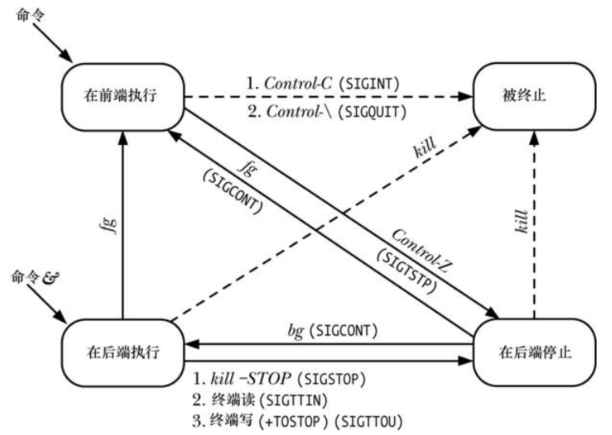
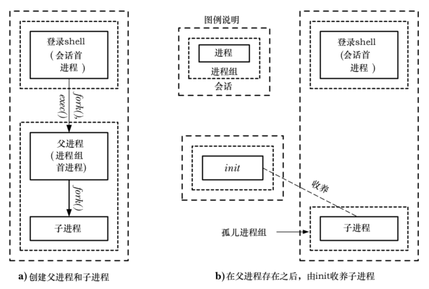

# 概述

**进程组**

- 进程组由一个或多个共享同一进程标识符 PGID 的进程组成，进程组 ID 的类型是 `pid_t`
- 一个进程组拥有一个进程组的首进程， 该进程是创建该组的进程，其进程 ID 为该进程组 ID
- 进程组拥有一个生命周期，其开始时间为首进程创建组的时刻，结束时间为最后一个成员进程退出组的时刻
- 一个进程可能会因为终止而退出进程组，也可能会因为加入了另外一个进程组而退出进程组，进程组首进程无需是最后一个离开进程组的成员。

**会话**

- 会话是一组进程组的集合，进程的会话成员关系是由其会话标识符 SID 确定的，会话标识符也是 `pid_t` 类型
- 会话首进程是创建该会话的进程，其进程 ID 会成为会话 ID，新进程会继承其父进程的会话 ID

**终端**

- 一个会话中的所有进程共享单个控制终端，控制终端会在会话首进程首次打开一个终端设备时被建立
- 一个终端最多可能成为一个会话的控制终端
- 在窗口环境中，控制终端是一个伪终端，每个终端窗口都有一个独立的会话，窗口的启动 shell 是会话首进程和终端的控制进程

**前台进程组和后台进程组**

- 在任一时刻，会话中的一个进程组会成为终端的前台进程组，其他进程组会成为后台进程组
- 只有前台进程组中的进程才能从控制终端中读取输入，当用户在控制终端中输入一个信号(例如：Control+C，Control+\，Control+Z)生成终端字符后，该信号会被发送到前台进程组中的所有成员

**控制进程**

- 当到控制终端的连接起来之后，会话首进程会成为该终端的控制进程
- 成为控制进程的主要标志是当断开与终端之间的连接时内核会向该进程发送一个 `SIGHUP` 信号

会话和进程组的主要用途是用于 shell 作业控制，对于交互式登录来讲，控制终端是用户登录的途径，登录 shell 是会话首进程和终端的控制进程，也是其自身进程组的唯一成员。从 shell 中发出的每个命令或通过管道连接的一组命令都会导致一个或多个进程的创建，并且 shell 会将这些进程放在一个新的进程组中，当命令或以管道连接的一组命令以 `&`  符号结束时会在后台进程组中运行这些命令，否则就会在前台进程组中运行这些命令。

```
echo $$		# 查看当前 shell 的 PID
400
find /2 > /dev/null | wc -l & # 运行两个后台进程
659
sort < longlist | uniq -c	# 运行两个前台进程
```


# 进程组

每个进程都拥有一个以数字表示的进程组 ID，表示该进程所属的进程组，新进程会继承其父进程的进程组 ID。

```
#include <unistd.h>

pid_t getpgrp(void); 
```

- `getpgrp()` 返回一个进程的进程组 ID
- 如果 `getpgrp()` 的返回值与调用进程的进程 ID 匹配的话就说明该调用进程是其进程组的首进程

```
#include <unistd.h>

pid_t setpgid(pid_t pid,pid_t pgid); 
```

- `setpgid()` 将 `pid` 进程的进程组ID 修改为 `pgid`
- 如果将 `pid` 的值设置为 0，那么调用进程的进程组 ID就会被改变，如果将 `pgid` 的值设置为 0，那么 ID 为 `pid` 的进程的进程的进程组 ID 会被设置成 `pid` 的值，因此，下面的 `setpgid()` 调用是等价的：

```
setpgid(0,0);
setpgid(getpid(),0);
setpgid(getpid(),getpid());
```

- 如果 `pid` 和 `pgid` 参数指定了同一进程，即 `pgid`  是 0 或者与 ID 为 `pid` 的进程的进程 ID 匹配，那么就会创建一个新进程组，并且指定的进程会成为这个新组的首进程
- 如果两个参数的值不同，即 `pgid` 不是 0 或者与 ID 为 `pid`  的进程的进程 ID 不匹配，那么 `setpgid()` 调用会将一个进程从一个进程组中移到另一个进程组中
- 通常调用 `setpgid()` 函数的是 shell 和 `login`
- 在调用 `setpgid()` 时存在以下限制：
  - `pid` 参数可以仅指定调用进程或其中一个子进程，违反这条规则会导致 ESRCH 错误
  - 在组之间移动进程时，调用进程、由 `pid` 指定的进程以及目标进程组必须要属于同一个会话，违反这条规则见导致 EPERM 错误
  - `pid` 参数所指定的进程不能是会话首进程，违反这条规则将导致 EPERM 错误
  - 一个进程在其进程已经执行  `exec()` 后就无法修改该子进程的进程组 ID，违反这条规则会导致 EACCES 错误

## 在作业控制 shell 中使用 `setpgid()`

一个进程在其子进程已经执行 `exec()` 之后就无法修改该子进程的进程组 ID 的约束条件会影响到基于 shell 的作业控制程序设计，即需要满足下列条件：

- 一个任务(即一个命令或一组以管道符连接的命令)中的所有进程必须被放置在一个进程组中，这一步允许 shell 使用 `killpg()` 来同时向进程组中的所有成员发送作业控制信号，一般来讲，这一步需要在发送任意作业控制信号前完成
- 每个子进程在执行程序之前必须要被分配到进程组中，因为程序本身是不清楚如何操作进程组 ID 的

# 会话

会话是一组进程组集合，一个进程的会话成员关系是由其会话 ID 来定义的，会话 ID 是一个数字，新进程会继承其父进程的会话 ID。

```
#define _XOPEN_SOURCE 500
#include <unistd.h>

pid_t getsid(pid_t pid);
```

- `getsid()` 系统调用返回 `pid` 指定的进程的会话 ID
- 如果 `pid`  参数的值为 0，那么 `getsid()` 会返回调用进程的会话 ID

```
#include <unistd.h>

pid_t setsid(void);
```

- 如果调用进程不是进程组首进程，那么 `setsid()` 会创建一个新会话
- 创建步骤如下：
  - 调用进程成为新会话的首进程和该会话中新进程组的首进程，调用进程的进程组 ID 和会话 ID 会被设置成该进程的进程 ID
  - 调用进程没有控制终端，所有之前到控制终端的连接都会被断开
- 如果调用进程是一个进程组首进程，那么 `setsid()`  调用会报 `EPERM` 错误，这种约束是很有必要的，因为如果没有这个约束的话，进程组组织就能够将其自身迁移到另一个新的会话之中，而该进程组的其他成员则仍然位于原来的会话中，这将破坏会话和进程组之间严格的两级层次，因此一个进程组的所有成员必须属于同一个会话

# 控制终端和控制进程

一个会话中的所有进程可能会拥有一个单个控制终端，会话在被创建出来的时候是没有控制终端的，当会话首进程首次打开一个还没有成为某个会话的控制终端的终端时会建立控制终端，除非在调用 `open()` 时指定了 `O_NOCTTY` 标记。一个终端至多只能成为一个会话的控制终端。

控制终端会被 `fork()` 创建的子进程继承并且在 `exec()` 调用中得到保持。

当会话首进程打开了一个控制终端之后它同时也会成为该终端的控制进程，在发生终端断开之后，内核会向控制进程发送一个 `SIGHUP` 信号来通知这一事件额度发生。

如果一个进程拥有一个控制终端，那么打开 `/dev/tty` 就能够获取该终端的文件描述符。这对于一个程序在标准输入和输出被重定向之后需要确保自己确实在与控制终端进行通信是很有用的。如果进程没有控制终端，那么打开 `/dev/tty` 时将会报  `ENXIO` 的错误。

## 删除进程与控制终端之间的关联关系

使用 `ioctl(fd,TIOCNOTTY)`  操作能够删除进程与文件描述符 `fd`  指定的控制终端之间的关联关系。一旦调用之后再试图打开 `/dev/tty` 文件之后就会失败。

如果调用进程是终端的控制进程，那么在控制进程终止时：

- 会话中的所有进程将会失去与控制终端之间的关联关系
- 控制终端失去了与会话之间的关联关系，因此另一个会话首进程就能够获取该终端以成为控制进程
- 内核会向前台进程组的所有成员发送一个 `SIGHUP`  信号和一个 `SIGCONT` 信号来通知它们控制终端的丢失

##  在 BSD 上建立一个控制终端

在 BSD 系统上，在会话首进程中打开一个终端不会导致该终端成为控制终端，不管是否指定了 `O_NOCTTY` 标记，相反，会话首进程需要使用 `ioctl() TIOCSCTTY` 操作来显式地将文件描述符 `fd` 指定的终端建立为控制终端：

```
if(ioctl(fd,TIOCSCTTY) == -1)
	errExit("ioctl()");
```

只有在会话没有控制终端时才能执行这个操作。

## 获取表示控制终端的路径名

```
#include <stdio.h>

char *ctermid(char *ttyname);
```

- `ctermid()` 返回表示控制终端的路径名
- 可以通过函数结果和指定 `ttyname` 缓冲区来获取路径名，如果 `ttyname` 不是 `NULL`，那么它是一个大小至少为 `L_ctermid` 字节的缓冲区，路径名会被复制到这个数组中，如果 `ttyname` 是 `NULL`  将返回一个指向静态分配的缓冲区的指针，是不可重入的

# 前台和后台进程组

控制终端保留了前台进程组的概念，在一个会话中，在同一时刻只有一个进程能成为前台进程，会话中的其他所有进程都是后台进程组。前台进程组是唯一能够自由地读取和写入控制终端的进程组。当在控制终端中输入一个信号生成终端字符之后，终端驱动器会将相应的信号发送给前台进程组的成员。

```
#include <unistd.h>

pid_t tcgetpgrp(int fd);

int tcsetpgrp(int fd, pid_t pgid);
```

- `tcgetpgrp()` 获取一个终端的进程组，`tcsetpgrp()` 修改一个终端的进程组，这两个函数主要供任务控制 shell 使用
- `tcgetpgrp()` 中的参数 `fd` 指定的必须是调用进程的控制终端
- `tcsetpgrp()` 中的参数 `pgid` 必须与调用进程所属的会话中的一个进程的进程组 ID 匹配

# SIGHUP 信号

当一个控制进程失去其终端连接之后，内核会向其发送一个 `SIGHUP` 信号来通知它这一事实，还会发送一个 `SIGCONT` 信号以确保当进程之前被一个信号停止时重新开始该进程，一般来讲，这种情况可能会在下面两个场景中出现：

- 当终端驱动器检测到连接断开后，表明调制解调器或终端行上信号的丢失
- 当工作站上的终端窗口被关闭时，发生这种情况是因为最近打开的与终端窗口关联的伪终端的主侧的文件描述符被关闭了

 `SIGHUP` 信号的默认处理方式是终止进程，如果控制进程处理了或忽略了这个信号，那么后续尝试从终端中读取数据的请求就会返回文件结束的错误。

向控制进程发送  `SIGHUP` 信号会引起一种链式反应，从而导致将  `SIGHUP` 信号发送给很多其他进程，这个过程可能会以下列两种方式发生：

- 控制进程通常是一个 shell，shell 建立一个  `SIGHUP` 信号的处理器，这样在进程终止前，它能够将 `SIGHUP` 信号发送给由它所创建的各个任务，在默认情况下，这个信号会终止那些任务，但如果它们捕捉了这个信号，就可以知道 shell 进程已经终止了
- 在终止终端的控制进程时，内核会解除会话中所有进程与该控制终端之间的关联关系以及控制终端与该会话的关联关系，并且通过向该终端的前台进程组的成员发送  `SIGHUP` 信号来通知它们控制终端的丢失

##　在 shell 中处理 SIGHUP 信号

在登录会话中，shell 通常是终端的控制进程，大多数 shell 程序在交互式运行时会为  `SIGHUP` 信号建立一个处理器，这个处理器会终止 shell，但在终止之前会向 shell 所创建的各个进程组发送一个  `SIGHUP` 信号，如何处理根据应用需求而定，如果不采取特殊动作，默认终止进程。

在  `SIGHUP` 信号发送之后，还可能发送一个 `SIGCONT` 信号，这依赖于 shell 本身以及任务当前是否处于停止状态。

## SIGHUP 和控制进程的终止

如果因为终端断开引起的向控制进程发送的 `SIGHUP` 信号会导致进程终止，那么 `SIGHUP` 信号会被发送给终端的前台进程组中的所有成员，这个行为是控制进程终止的结果，而不是专门与 `SIGHUP` 信号关联的行为，如果控制进程出于任何原因终止，那么前台进程组就会收到 `SIGHUP` 信号。

# 作业控制

作业控制允许一个 shell 用户同时执行多个命令(作业)，其中一个命令在前台运行，其余的命令在后台运行，作业可以被停止和恢复以及在前后台之间移动。

## 在 shell 中使用作业控制

当输入的命令以  `&` 结尾，该命令会作为后台任务运行。

shell 会为后台的每个进程赋一个唯一的作业号，当作业在后台运行之后以及在使用各种作业控制命令操作或监控作业时作业号会显示在方括号中，作业号后面的数字是执行这个命令的进程的进程 ID或管道中最后一个进程的进程 ID。

`jobs` 是 shell 内置的一个命令，它会列出所有后台作业。

`fg` 也是 shell 内置命令，可以讲一个后台进程移到前台。

```
ubuntu:/mnt/$ sleep 60 &
[1] 673
ubuntu:/mnt/$ jobs
[1]+  Running                 sleep 60 &
ubuntu:/mnt/$ fg %1
sleep 60
```

当作业在前台运行时，可以使用终端挂起字符 `Control+Z`  来挂起作业，它会向终端的前台进程组发送一个 `SIGTSTP` 信号。按下 `Control+Z` 之后，shell 会打印出在后台被停止的命令，如果需要的话，可以使用 `fg` 在前台恢复这个作业或使用 `bg` 命令在后台恢复这个命令。不管使用哪个命令恢复作业，shell 都会通过向任务发送一个  `SIGCONT` 信号来恢复被停止的作业。

作业具备多种状态，作业控制以及 shell 命令和终端字符可以使作业在不同状态之间迁移：



## 实现作业控制

实现必须要提供特定的作业控制信号：`SIGTSTP`，`SIGSTOP`，`SIGCONT`，`SIGTTOU`，`SIGTTIN`，`SIGCHILD`。

终端驱动器必须要支持作业控制信号的生成，这样当输入特定的字符或进行终端 IO 以及在后台作业中执行特定的其他终端操作时需要将恰当的信号发送到相关的进程组，为了能够完成这些动作，终端驱动器必须要记录与终端相关联的会话 ID 和前台进程组 ID。

shell 必须要支持作业控制，这种支持是通过将作业在前台和后台之间迁移以及监控作业的状态的命令的形式来完成。

### SIGTTIN 和 SIGTTOU

当进程当前处于阻塞状态或者忽视 `SIGTTIN` 信号的状态时则不发送 `SIGTTIN`  信号，这时视图从控制终端发起 `read()` 调用会失败，设置 `errno` 为 `EIO`。

即使终端被设置了 `TOSTOP` 标记，当进程当前处于阻塞状态或忽视 `SIGTTIN`  信号的状态时也不会发送 `SIGTTOU` 信号，这时从控制终端发起 `write()` 调用是允许的。

不管是否设置了 `TOSTOP` 标记，当后台进程试图在控制终端上调用会修改终端驱动器数据结构的特定函数时会生成 `SIGTTOU` 信号，这些函数包括：`tcsetpgrp()`，`tcsetattr()`，`tcflush()`，`tcflow()`，`tcsendbreak()`，`tcdrain()`，如果 `SIGTTOU` 信号被阻塞或忽视了，那么这些调用会成功。

# 处理作业控制信号

如果 `SIGTSTP` 信号被捕获了，那么就不会执行默认的停止进程的动作。

`SIGSTOP` 信号是无法被捕获、阻塞和忽略的，因此能确保立即停止进程。

恰当的处理`SIGTSTP` 信号的方式是在 `SIGTSTP` 信号处理器中再生成一个 `SIGTSTP` 信号来停止进程：

- 处理器将 `SIGTSTP` 信号的处置重置为默认值 `SIG_DFL`
- 处理器生成 `SIGTSTP` 信号
- 由于 `SIGTSTP` 信号会被阻塞进入处理器，因此处理器会解除该信号的阻塞，上一步生成的 `SIGTSTP` 信号会导致默认行为：进程被立即挂起
- 在后面的某个时刻，当进程接收到 `SIGCONT`  信号会恢复，这时处理器的执行将继续
- 在返回之前，处理器会重新阻塞 `SIGTSTP` 信号并重新注册本身来处理下一个 `SIGTSTP` 信号

### 处理被忽略的任务控制和终端生成的信号

应用程序应该在作业控制和终端生成信号不被忽略的时候才处理这些信号，对于作业控制新信号 `SIGTSTP`,`SIGTTIN`,`SIGTTOU` 来讲，这个规则防止应用程序视图处理那些从非作业控制 shell 发出的信号，在非作业控制 shell 中，这些信号的处理被设置成 `SIG_IGN`，只有作业控制 shell 将这些信号的处理设置成了 `SIG_DFL`。

## 孤儿进程组

父进程终止之后，子进程不仅是一个孤儿进程，同时也是孤儿进程组的一员。

SUSv3 认为当一个进程组满足：每个成员的父进程本身是组的一个成员或不是组会话的一个成员时就变成了一个孤儿进程组，也就是，如果一个进程组中至少有一个成员拥有一个位于同一会话但不同进程组中的父进程，就不是孤儿进程组。



- 在父进程退出之前，子进程被停止了
- 当父进程退出时 shell 从作业列表中删除了父进程的进程组，子进程由 init 收养并变成了终端的一个后台进程，包含该子进程的进程组变成了孤儿进程组
- 这时没有进程会通过 `wait()` 监控被停止的子进程的状态


