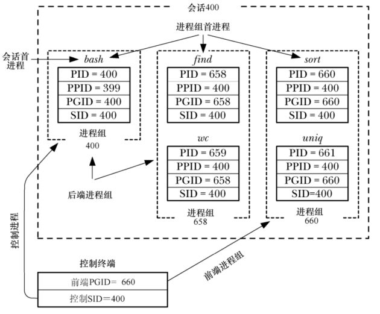

# 概述

**进程组**

- 进程组由一个或多个共享同一进程标识符 PGID 的进程组成，进程组 ID 的类型是 `pid_t`
- 一个进程组拥有一个进程组的首进程， 该进程是创建该组的进程，其进程 ID 为该进程组 ID
- 进程组拥有一个生命周期，其开始时间为首进程创建组的时刻，结束时间为最后一个成员进程退出组的时刻
- 一个进程可能会因为终止而退出进程组，也可能会因为加入了另外一个进程组而退出进程组，进程组首进程无需是最后一个离开进程组的成员。

**会话**

- 会话是一组进程组的集合，进程的会话成员关系是由其会话标识符 SID 确定的，会话标识符也是 `pid_t` 类型
- 会话首进程是创建该会话的进程，其进程 ID 会成为会话 ID，新进程会继承其父进程的会话 ID

**终端**

- 一个会话中的所有进程共享单个控制终端，控制终端会在会话首进程首次打开一个终端设备时被建立
- 一个终端最多可能成为一个会话的控制终端
- 在窗口环境中，控制终端是一个伪终端，每个终端窗口都有一个独立的会话，窗口的启动 shell 是会话首进程和终端的控制进程

**前台进程组和后台进程组**

- 在任一时刻，会话中的一个进程组会成为终端的前台进程组，其他进程组会成为后台进程组
- 只有前台进程组中的进程才能从控制终端中读取输入，当用户在控制终端中输入一个信号(例如：Control+C，Control+\，Control+Z)生成终端字符后，该信号会被发送到前台进程组中的所有成员

**控制进程**

- 当到控制终端的连接起来之后，会话首进程会成为该终端的控制进程
- 成为控制进程的主要标志是当断开与终端之间的连接时内核会向该进程发送一个 `SIGHUP` 信号

会话和进程组的主要用途是用于 shell 作业控制，对于交互式登录来讲，控制终端是用户登录的途径，登录 shell 是会话首进程和终端的控制进程，也是其自身进程组的唯一成员。从 shell 中发出的每个命令或通过管道连接的一组命令都会导致一个或多个进程的创建，并且 shell 会将这些进程放在一个新的进程组中，当命令或以管道连接的一组命令以 `&`  符号结束时会在后台进程组中运行这些命令，否则就会在前台进程组中运行这些命令。

```
echo $$		# 查看当前 shell 的 PID
400
find /2 > /dev/null | wc -l & # 运行两个后台进程
659
sort < longlist | uniq -c	# 运行两个前台进程
```



# 进程组

每个进程都拥有一个以数字表示的进程组 ID，表示该进程所属的进程组，新进程会继承其父进程的进程组 ID。

```
#include <unistd.h>

pid_t getpgrp(void); 
```

- `getpgrp()` 返回一个进程的进程组 ID
- 如果 `getpgrp()` 的返回值与调用进程的进程 ID 匹配的话就说明该调用进程是其进程组的首进程

```
#include <unistd.h>

pid_t setpgid(pid_t pid,pid_t pgid); 
```

- `setpgid()` 将 `pid` 进程的进程组ID 修改为 `pgid`
- 如果将 `pid` 的值设置为 0，那么调用进程的进程组 ID就会被改变，如果将 `pgid` 的值设置为 0，那么 ID 为 `pid` 的进程的进程的进程组 ID 会被设置成 `pid` 的值，因此，下面的 `setpgid()` 调用是等价的：

```
setpgid(0,0);
setpgid(getpid(),0);
setpgid(getpid(),getpid());
```

- 如果 `pid` 和 `pgid` 参数指定了同一进程，即 `pgid`  是 0 或者与 ID 为 `pid` 的进程的进程 ID 匹配，那么就会创建一个新进程组，并且指定的进程会成为这个新组的首进程
- 如果两个参数的值不同，即 `pgid` 不是 0 或者与 ID 为 `pid`  的进程的进程 ID 不匹配，那么 `setpgid()` 调用会将一个进程从一个进程组中移到另一个进程组中
- 通常调用 `setpgid()` 函数的是 shell 和 `login`
- 在调用 `setpgid()` 时存在以下限制：
  - `pid` 参数可以仅指定调用进程或其中一个子进程，违反这条规则会导致 ESRCH 错误
  - 在组之间移动进程时，调用进程、由 `pid` 指定的进程以及目标进程组必须要属于同一个会话，违反这条规则见导致 EPERM 错误
  - `pid` 参数所指定的进程不能是会话首进程，违反这条规则将导致 EPERM 错误
  - 一个进程在其进程已经执行  `exec()` 后就无法修改该子进程的进程组 ID，违反这条规则会导致 EACCES 错误

## 在作业控制 shell 中使用 `setpgid()`

一个进程在其子进程已经执行 `exec()` 之后就无法修改该子进程的进程组 ID 的约束条件会影响到基于 shell 的作业控制程序设计，即需要满足下列条件：

- 一个任务(即一个命令或一组以管道符连接的命令)中的所有进程必须被放置在一个进程组中，这一步允许 shell 使用 `killpg()` 来同时向进程组中的所有成员发送作业控制信号，一般来讲，这一步需要在发送任意作业控制信号前完成
- 每个子进程在执行程序之前必须要被分配到进程组中，因为程序本身是不清楚如何操作进程组 ID 的


