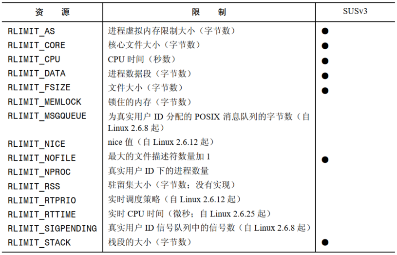

# 进程资源使用

```
#include <sys/time.h>
#include <sys/resource.h>

int getrusage(int who, struct rusage *usage);
```

- `getrusage()` 返回调用进程或其子进程用掉的各类资源的统计信息
- `who` 指定了需查询资源使用信息的进程，其取值为：
  - `RUSAGE_SELF`：返回调用进程的相关信息
  - `RUSAGE_CHILDREN`：返回调用进程的所有被终止和处于等待状态的子进程相关的信息
  - `RUSAGE_THREAD`：Linux 特有，返回调用线程的相关信息
- `rusage`：

```
 struct rusage {
               struct timeval ru_utime; /* user CPU time used */
               struct timeval ru_stime; /* system CPU time used */
               long   ru_maxrss;        /* maximum resident set size */
               long   ru_ixrss;         /* integral shared memory size */
               long   ru_idrss;         /* integral unshared data size */
               long   ru_isrss;         /* integral unshared stack size */
               long   ru_minflt;        /* page reclaims (soft page faults) */
               long   ru_majflt;        /* page faults (hard page faults) */
               long   ru_nswap;         /* swaps */
               long   ru_inblock;       /* block input operations */
               long   ru_oublock;       /* block output operations */
               long   ru_msgsnd;        /* IPC messages sent */
               long   ru_msgrcv;        /* IPC messages received */
               long   ru_nsignals;      /* signals received */
               long   ru_nvcsw;         /* voluntary context switches */
               long   ru_nivcsw;        /* involuntary context switches */
           };
```

- `ru_utime` 和 `ru_stime`  字段的类型是 `timeval` 结构，分别表示一个进程在用户模式和内核模式下消耗的 CPU 的秒数和毫秒数
- 在 `RUSAGE_CHILDREN` 操作中，`ru_maxrss` 字段返回调用进程的所有子孙进程中最大驻留集大小，不是所有子孙进程之和

# 进程资源限制

每个进程都用一组资源限值，它们可以用来限制进程能够消耗的各种系统资源。可以示使用 `ulimit` 设置  shell 的资源限制，shell 创建用来执行用户命令的进程会继承这些限制。

```
#include <sys/time.h>
#include <sys/resource.h>

int getrlimit(int resource, struct rlimit *rlim);
int setrlimit(int resource, const struct rlimit *rlim);
```

- `getrlimit()` 和 `setrlimit()` 允许一个进程读取和修改自己的资源限制
- `resource` 参数标识了需读取或修改的资源限制，`rlim` 用来指定或者返回限制值：

```
 struct rlimit {
               rlim_t rlim_cur;  /* Soft limit */
               rlim_t rlim_max;  /* Hard limit (ceiling for rlim_cur) */
           };
```

- `rlim_cur` 是资源的软限制，软限制规定了进程能够消耗的资源总量，一个进程可以将软限制调整为从 0 到硬限制之间的值
- `rlim_max` 是资源的硬限制，其作用为软限制设定上限，特权进程能够增大和缩小硬限制，非特权进程只能缩小硬限制，但是这个行为不可逆
- 当 `rlim_cur` 和 `rlim_max` 的取值为 `RLIM_INFINITY` 表示没有限制

在大多数情况下，特权进程和非特权进程在使用资源时都会受到限制，通过 `fork()`  创建的子进程会继承这些限制并且在 `exec()` 调用之间不得到保持。



## 无法表示的限制值

在某些程序设计环境中，`rlim_t` 数据类型可能无法表示某个特定资源限制的所有可取值，这是因为 `rlim_t` 数据类型的大小是不同的。如当一个 `off_t` 为 64 位的大型编译环境被添加到 `off_t` 为 32 位的系统中时就会出现此情况。
SUSv3 规定了两个常量来标记无法表示的限制值：`RLIM_SAVED_CUR` 和 `RLIM_SAVED_MAX`。

# 特定资源限制细节

## RLIMIT_AS

`RLIMIT_AS` 限制规定了进程的虚拟内存的最大字节数，试图 `brk()`，`sbrk()`，`mmap()`，`mremap()`，`shmat()` 超出这个限制会得到 `ENOMEM` 错误，当碰到这个限制时，栈增长操作也会失败，进而会出现 `RLIMIT_STACK` 限制列出的情况。

## RLIMIT_CORE

`RLIMIT_CORE` 限制规定了当进程被特定信号终止时产生的 core dump 文件的最大字节数。当达到这个限制时，core dump 文件就不会再产生，将这个限制指定为 0 会阻止 core dump 文件的创建，如果 `RLIMIT_FSIZE` 限制值低于这个限制值，那么 core dump 文件的最大大小会被限制为 `RLIMIT_FSIZE` 字节。

## RLIMT_CPU

`RLIMT_CPU` 限制规定了进程最多使用的 CPU 时间(包括系统模式和用户模式)，SUSv 要求达到软限制值时需要向进程发送一个 `SIGXCPU` 信号， `SIGXCPU` 信号默认将终止一个进程并输出一个 core dump。

## RLIMIT_DATA

`RLIMIT_DATA` 限制规定了进程的数据段的最大字节数，试图 `sbrk()` 和 `brk()` 访问这个限制之外的数据段会得到 `ENOMEM` 错误。

## RLIMIT_FSIZE

`RLIMIT_FSIZE` 限制规定了进程能够创建的文件的最大字节数，如果进程试图扩充一个文件使之超出软限制值，那么内核就会向其发送一个 `SIGXFSZ` 信号，并且系统调用如 `write()` 或 `truncate()` 会返回 `EFBIG`  错误，`SIGXFSZ` 信号的默认动作是终止进程并产生一个 core dump。

## RLIMIT_MEMLOCK

`RLIMIT_MEMLOCK` 限制规定了一个进程最多能够将多少字节的虚拟内存锁进物理内存以防止被交换出去，如果在调用 `mlockall()` 时指定了 `MCL_FUTURE` 标记，那么 `RLIMIT_MEMLOCK` 限制也会导致 `brk()`， `sbrk()`， `mmap()`， `mremap()` 调用失败。

## RLIMIT_MSGQUEUE

`RLIMIT_MSGQUEUE` 限制规定了能够为调用进程的真实用户 ID 的 POSIX 消息队列分配的最大字节数，当使用 `mq_open()` 创建了一个 POSIX 消息队列后会根据下面的公式将字节数与这个限制值进行比较：

```
bytes = attr.mq_maxmsg * sizeof(struct msg_msg*) + attr.mq_maxmsg * attr.mq_msgsize;
```

`RLIMIT_MSGQUEUE` 限制只会影响调用进程，这个用户下的其他进程不会受到影响，因为它们也会设置这个限制或继承这个限制。

## RLIMIT_NICE

`RLIMIT_NICE` 限制规定了使用 `sched_setscheduler()` 和 `nice()` 能够为进程设置的最大 `nice` 值，这个最大值通过 `20-rlim_cur` 计算得来。

## RLIMIT_NOFILE

 `RLIMIT_NOFILE` 限制规定了一个数值，该数值等于一个进程能够分配的最大文件描述符数量加1，试图通过 `open()`，`pipe()`，`socket()`，`accept()`，`shm_open()`，`dup()`，`dup2()`，`fcntl(F_DUPFD)`，`epoll_create()` 分配的文件描述符数量超出这个限制时就会失败，大多数情况下，失败的错误是 `EMFILE`，但在 `dup2(fd,newfd)` 调用中，失败的错误是 `EBADF`，在 `fcntl(fd,F_DUPFD,newfd)` 调用中当 `newfd` 大于或等于这个限制时，失败的错误为 `EINVAL`。

对 `RLIMIT_NOFILE` 限制的变更会通过 `sysconf(_SC_OPEN_MAX)` 的返回值反应出来。

内核为 `RLIMIT_NOFILE` 限制规定了一个最大值，这个最大值是一个由内核常量 `NR_OPEN` 定义的硬编码值，Linux 下可以通过 `/proc/sys/fs/nr_open` 文件定义，超级用户可以修改这个值。

还存在一个系统级别的限制，它规定了系统中所有进程能够打开的文件数量，通过 Linux 特有的 `/proc/sys/fs/file-max` 文件能够获取和修改这个限制。只有特权进程才能够超出 `file-max` 的限制，在非特权进程中，当系统调用碰到 `file-max` 限制时会返回 `ENFILE` 错误。

## RLIMIT_NPROC


