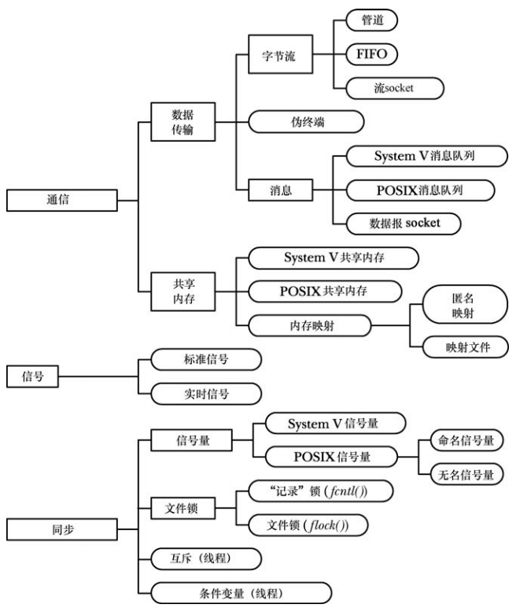
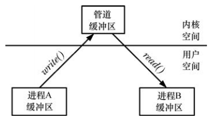
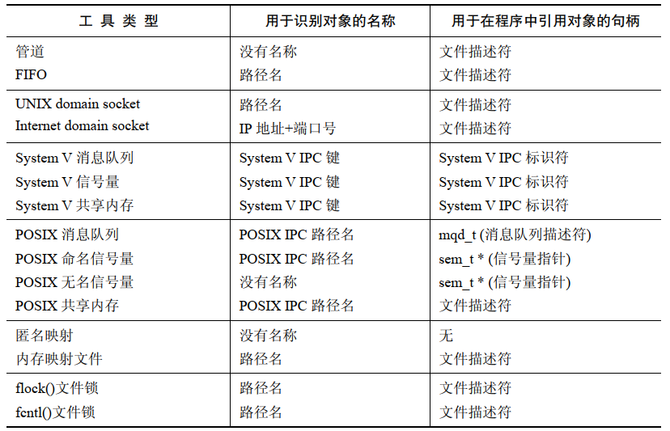
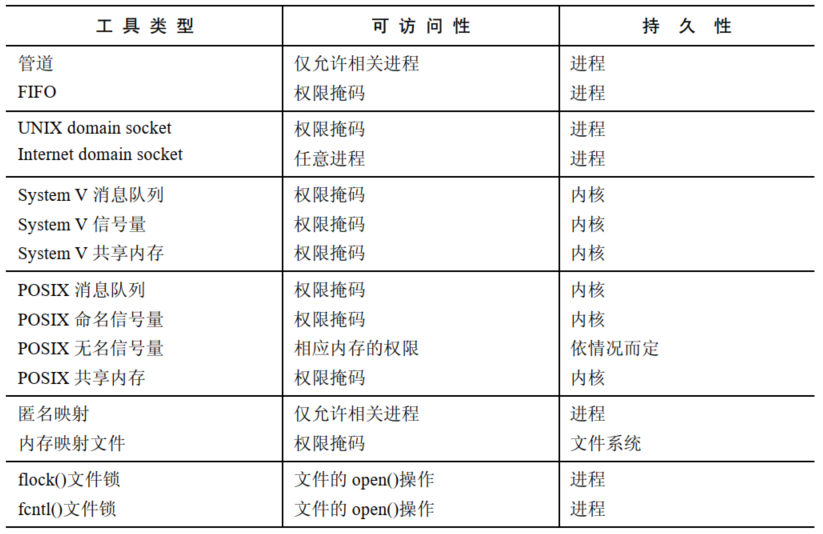

# IPC 工具分类

Unix系统上各种通信和同步工具可以分为三类：

- 通信：这些工具关注进程间的数据交换
- 同步：这些进程关注进程和线程操作之间的同步
- 信号：虽然信号的主要作用不为此，但是在特定场景下仍然可以将它作为一种同步工具；另外，信号也可以通信：信号编码本身是一种形式的信息，并且可以在实时信号上上绑定数据（一个整数或指针）

# 通信工具

通信工具可以用来在进程间相互交换数据（这些工具还可以用来在同一个进程中不同线程之间交换数据，但很少需要这样做，因为线程之间可以通过共享全局变量来交换信息。）

可以将通信工具分成两类。

- 数据传输工具：
  - 为了进行通信，一个进程将数据写入到 IPC 工具中，另一个进程从中读取数据
  - 这些工具要求在用户内存和内核内存之间进行两次数据传输：
    - 一次传输是在写入的时候从用户内存到内核内存
    - 另一次传输时在读取的时候从内核内存到用户内存

- 共享内存：
  - 共享内存运行进程通过将数据放到由进程间共享的一块内存中以完成这些信息的交换(内核通过将每个进程中的页表条目指向同一个RAM分页来实现这一功能)
  - 一个进程可以通过将数据放到共享内存块中使得其他进程读取这些数据
  - 由于通信无需系统调用以及用户内存和内核内存之间的数据传输，因此共享内存的速度非常快

## 数据传输

可以进一步将数据传输工具分成下列类别。

- 字节流：
  - 通过管道、FIFO以及数据报 socket 交换的数据是一个无分隔符的字节流
  - 每个读取操作可能会从 IPC 工具中读取任意数量的字节，不管写者写入的块的大小是什么
  - 这个模型参考了传统的 UNIX "文件是一个字节序列" 模型
- 消息：
  - 通过 System V 消息队列、POSIX 消息队列以及数据报 socket 交换的数据是以分隔符分隔的消息
  - 每个读取操作读取由写者写入的一整条消息，无法只读取部分消息，而把剩余部分留在 IPC 工具中，也无法在一个读取操作中读取多条消息
- 伪终端：伪终端是一种在特殊情况下使用的通信工具

数据传输工具和共享内存之间的差别包括以下几个方面：

- 尽管一个数据传输工具可能会有多个读取者，但是读取操作是有破坏性的。读取操作会消耗数据，其他进程将无法获取所消耗的数据
- 读取者和写者进程之间的同步是原子的。如果一个读取者试图从一个当前不包含数据的数据传输工具中读取数据，那么默认情况下读取操作会一直阻塞直到一些进程向该进程写入了数据

## 共享内存

大多数现代Unix系统提供了三种形式的共享内存：System V 共享内存、POSIX 共享内存以及内存映射。

注意：

- 尽管共享内存的通信速度更快，但是速度上的优势是用来弥补需要对在共享内存上发生的操作进行同步的不足的。如当一个进程正在更新共享内存中的一个数据结构时，另一个进程就不应该试图读取这个数据结构。在共享内存中，信号量通常用来作为同步方法
- 放入共享内存中的数据对所有共享这块内存的进程可见

# 同步工具

用于协调进程的操作。通过同步可以防止进程执行诸如同时更新一块共享内存或同时更新文件的同一个数据块之类的操作。如果没有同步，那么这种同时更新的操作可能会导致应用程序产生错误的结果。

UNIX 系统提供了下列同步工具：

- 互斥量和条件变量：这些同步工具通常用于 POSIX 线程

- 信号量：

  - 一个信号量是一个由内核维护的整数。其值永远不会小于0
  - 一个进程可以增加或者减少一个信号量的值。如果一个进程试图将信号量值减少到0，那么内核会阻塞该操作直到信号量增长到允许执行该操作的程序(或者进程可以要求执行一个非阻塞操作，那么就不会发生阻塞，内核会让该操作立即返回并返回一个标示无法立即执行该操作的错误)
  - 信号量的含义是由应用程序来确定的。一个进程减小一个信号量（如从 1 到 0）是为了预约对某些共享资源的独占访问，在完成了资源的使用之后可以增加信号量来释放共享资源以供其他进程使用
  - 最常用的信号量是二值信号量，一个值只能是 0 或 1 的信号量，但处理一类共享资源拥有多个实例的应用程序需要使用最大值等于共享资源数的信号量
  - Linux 既提供了 System V 信号量，又提供了 POSIX 信号量，它们的功能是类似的

- 文件锁：

  - 文件锁是设计用来协调同一文件的多个进程的动作的一种同步方法。它也可以用来协调对其他共享资源的访问
  - 文件锁分为两类：读（共享）锁和写（互斥）锁。任意进程都可以持有同一文件（或一个文件的某段区域）的读锁，但当一个进程持有了一个文件（或文件区域）的写锁之后，其他进程将无法获取该文件（或文件区域）上的读锁和写锁
  - Linux 通过 `flock()` 和  `fcntl()` 系统调用来提供文件加锁工具。`flock()` 系统调用提供了一种简单的加锁机制，允许进程将一个共享或互斥锁加到整个文件上。由于功能有限，现在已经很少使用 `flock()` 这个加锁工具了。`fcntl()` 系统调用提供了记录加锁，允许进程在同一文件的不同区域上加上多个读锁和写锁

在执行进程间同步时通常需要根据功能需求来选择工具。当协调对文件的访问时文件记录加锁通常是最佳的选择，而对于协调对其他共享资源的访问来讲，信号量通常是更佳的选择。

Linux 通过 `eventfd()` 系统调用额外提供了一种非标准的同步机制。这个系统调用创建了一个 `eventfd` 对象，该对象拥有一个相关的由内核维护的 8 字节无符号整数，它返回一个指向该对象的文件描述符。向这个文件描述符中写入一个整数会把该整数加到对象值上。当对象值为 0 时对该文件描述符的 `read()` 操作将会被阻塞。如果对象的值非0，那么 `read()` 会返回该值并将对象值重置为0。此外，可以使用 `poll()`、`select()` 以及 `epoll()` 来测试对象值是否为非零，如果是非零的话就表示文件描述符可读。

# IPC 工具比较

## IPC 对象标识和打开对象的句柄

要访问一个 IPC 对象，进程必须要通过某种方式来标识出该对象，一旦将对象"打开"之后，进程必须要使用某种句柄来引用该打开的对象。

## 功能

数据传输工具和共享内存之间的差异：

- 数据传输工具提供了读取和写入操作，传输的数据只供一个读者进程消耗。内核会自动处理读者和写者之间的流控以及同步（这样当读者试图从当前为空的工具中读取数据时将会阻塞）
- 一个进程通过共享内存能够使数据对共享同一内存区域的所有进程可见。通信“操作”是比较简单的，进程可以像访问自己的虚拟地址空间中的内存那样访问共享内存中的数据。另一个方面，同步处理（可能还会有流控）会增加共享内存设计的复杂性

关于各种数据传输工具，下面几点是值得注意的：

- 一些数据传输工具以字节流的形式传输数据(管道、FIFO以及流 socket)，另一些则是面向消息的(消息队列和数据报 socket)。到底选择何种方法则需要依赖于应用程序(应用程序也可以在一个字节流工具上应用面对消息的模型，这可以通过分隔字符、固定长度的消息，或者对整条消息进行编码的消息头来实现)
- 与其他数据传输工具相比，System V 和 POSIX 消息对象特有的一个特性是它们能够给消息赋一个数值类型或者优先级，这样传递消息的顺序就可以与发送消息的顺序不同了
- 管道、FIFO 以及 socket 是使用文件描述符来实现的。这些IPC工具都支持：IP多路复用(select()和poll()系统调用)、信号驱动的IO、以及Linux特有的epoll API。这些技术的主要优势在于它们允许应用程序同时监控多个文件描述符以判断是否可以在某些文件描述符上执行IO操作。与之相比，System V消息队列没有使用文件描述符，因此并不支持这些技术
- POSIX 消息队列提供了一个通知工具，当一条消息进入了一个之前为空的队列时可以使用它来向进程发送信号或者实例化一个新线程
- UNIX domain socket 提供了一个特性允许在进程间传递文件描述符。这样一个进行就能够打开一个文件并使之对另一个本来无法访问该文件的进程可用
- UDP（Internet domain datagram）socket 允许发送者向多个接受者广播或者组播一条消息

关于进程同步工具，下面几点是值得注意的：

- 使用 `fcntl()` 加上的记录锁由加锁的进程拥有。内核使用这种所有权属性来检测死锁（两个或多个进程持有的锁会阻塞对方后续的加锁请求的场景）。如果发生了死锁，那么内核会拒绝其中一个进程的加锁请求，因此会在 `fcntl()` 调用中返回一个错误标示出死锁的反思。System V 和 POSIX 信号量并没有所有权属性，因此内核不会为信号量进行死锁检测
- 当使用 `fcntl()` 获得记录锁的进程终止之后会自动释放该记录锁。System V 信号量提供了一个类似的特性，即“撤销”特性，但这个特性仅在部分场景中可靠。POSIX 信号量并没有提供类似的特性

## 网络通信

在上面所有的 IPC 方法中，只有 socket 运行进程通过网络来通信。

socket一般用于两个域中：

- 一个是 UNIX domain，它允许位于同一系统上的进程进行通信
- 另一个是 Internet domain，它允许位于通过 TCP/IP 网络进行连接的不同主机上的进程进行通信

## 可移植性性

现代 UNIX 实现支持上图中的大部分 IPC 工具，但 POSIX IPC 工具（消息队列、信号量以及共享内存）的普及程度远远不如 System V IPC，特别是在较早的 UNIX 系统上。因此，从可移植性的角度来看，System V IPC 要优于 POSIX IPC。

## System V IPC 设计问题

System V IPC 工具被设计成独立于传统 Unix IO 模型，其结果是其中一些特性使得它的编程接口的用法更加复杂。相应的 POSIX IPC 工具被设计用来解决这些问题。也被是下面几点要注意：

- System V IPC 工具是无连接的，它们没有提供引用一个打开的 IPC 对象的句柄（类似于文件描述符）通常说的 "打开" 一个 System V IPC 对象值得是描述进程获取一个引用该对象的句柄的简便方式。内核不会记录进程已经"打开"了该对象(与其他 IPC 对象不同)。这意味着内核无法维护当前使用该对象的进程的引用计数，其结果是应用程序需要使用额外的代码来知道何时可以安全的删除一个对象
- System V IPC 工具的编程接口与传统的 Unix IO 模型是不一致的（它们使用整数键值和 IPC 标识符，而不是路径名和文件描述符），并且这个编程接口也过于复杂了。这一点在 System V 信号量上表现得特别明显

相反，内核会为 POSIX IPC 对象记录打开的引用数，这样就简化了何时删除对象的决策。此外，POSIX IPC 提供的接口更加简单并且与传统的 UNIX 模型也更加一致。

## 可访问性

- 对于一些 IPC 工具比如 FIFO 和 socket，对象名位于文件系统中，可访问性是根据相关的文件权限掩码（指定了所有者、组和其他用户的权限）来确定的。虽然 System V IPC 对象并不位于文件系统中，但每个对象拥有一个相关的权限掩码，其语义与文件的权限掩码类似
- 一些 IPC 工具(管道、匿名内存映射)被标记成只允许相关进程访问。这里"相关"指通过 `fork()` 关联的。为了使两个进程能够访问同一个对象，其中一个必须要创建该对象，然后调用 `fork()`。而 `fork()` 调用的结构就是子进程会继承引用该对象的一个句柄，这样两个进程就能够共享对象了
- POSIX 未命名信号量的可访问性是通过包含该信号量的共享内存区域的可访问性来确定的
- 为了给一个文件加锁，进程必须拥有一个引用该文件的文件描述符符（即在实践中它必须要拥有打开文件的权限）
- 对 Internet domain socket 的访问（即连接或发送数据报）没有限制。如果有需要的话，必须要在应用程序中实现访问控制

## 持久性

"持久性" 指的是一个IPC工具的生命周期。持有性有三种：

- 进程持久性：只要存在一个进程持有进程持久的 IPC 对象，那么该对象的生命周期就不会终止。如果所有进程都关闭了对象，那么与该对象的所有内核资源都会被释放，所有未读取的数据会被销毁。管道、FIFO 以及 socket 是进程持久的 IPC 工具
- 内核持久性：只有当显式地删除内核持久的 IPC 对象或系统关闭时，该对象才会销毁。这种对象的生命周期与是否有进程打开该对象无关。这意味着一个进程可以创建一个对象，向其中写入数据，然后关闭该对象（或终止）。在后面某个时刻，另一个进程可以打开该对象，然后从中读取数据。具备内核持久性的工具包括 System V IPC 和POSIX IPC
- 文件系统持久性：具备文件系统持久性的 IPC 对象会在系统重启的时候保持其中的信息，这种对象一直存在直到被显式的删除。唯一一种句柄文件系统持久性的 IPC 对象是基于内存映射文件的共享内存

## 性能

在一些场景中，不同的 IPC 工具性能可能存在显著差异：

- 在应用程序整体性能中，IPC 工具的性能影响因素不大，确定选择何种 IPC 工具一般不会考虑其性能因素
- 各种 IPC 工具在不同的 UNIX 和 Linux 内核实现上性能可能是不同的
- IPC 性能可能会受到使用方式和环境的影响

